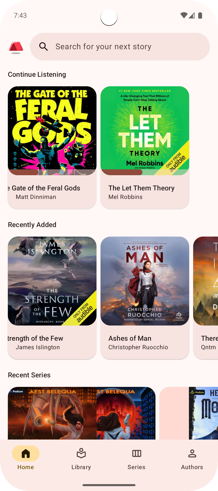
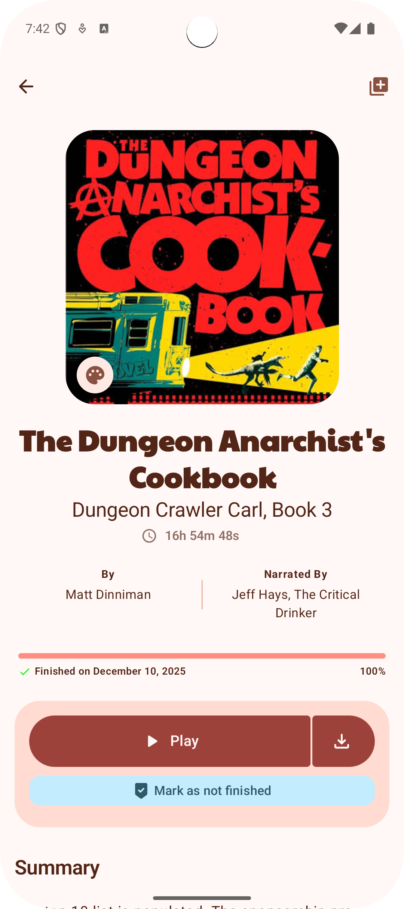
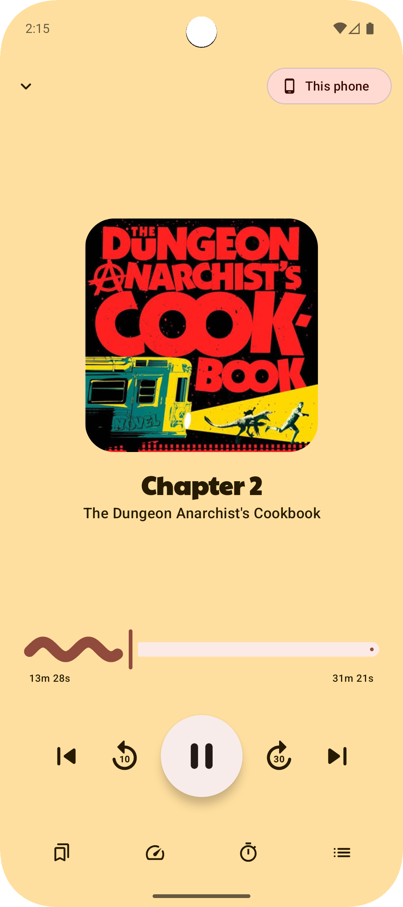
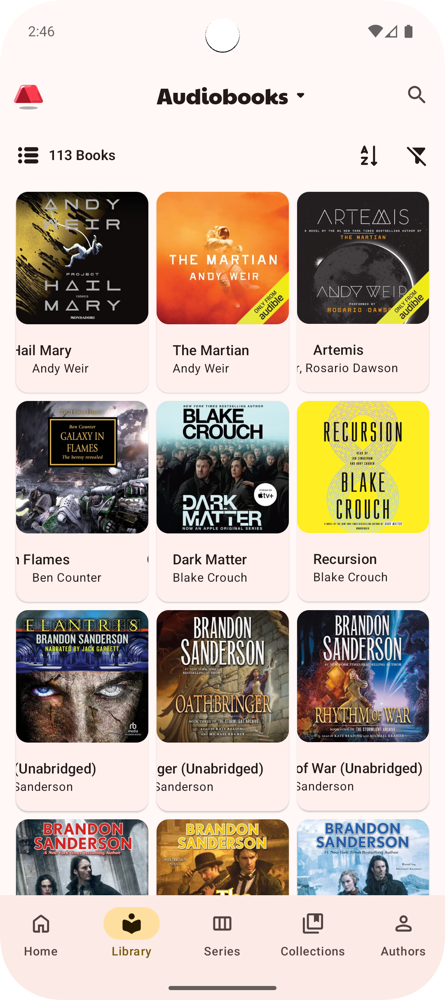
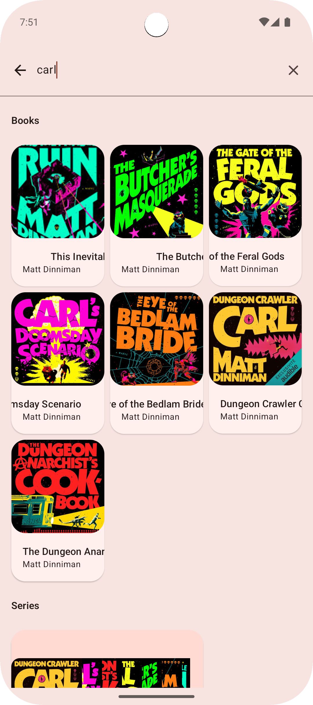
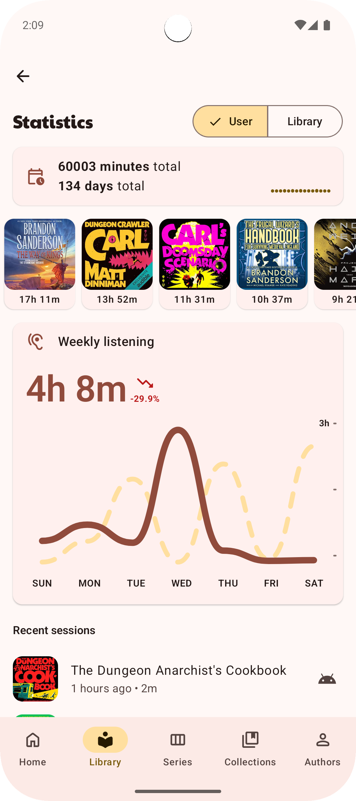
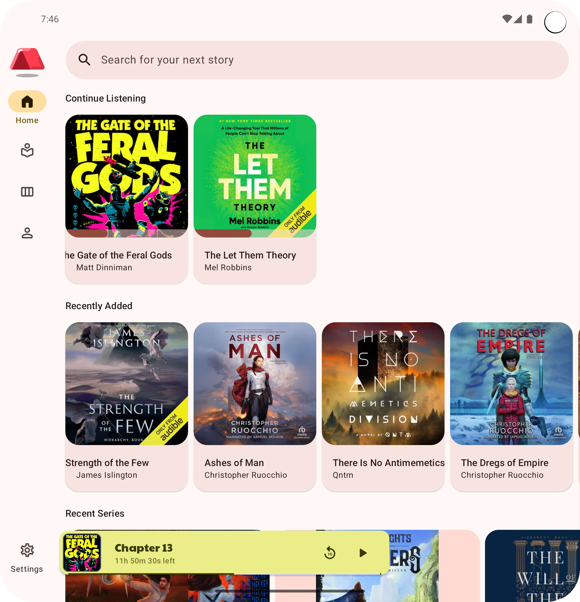

# Campfire

**Campfire** is an unofficial app for [Audiobookshelf](https://www.audiobookshelf.org/) built in Kotlin/Compose Multiplatform for a more native experience than the official app.

> [!IMPORTANT]
> This is a **WIP** project and no timeline will be given at this point in time

## Install
If you would like to install **Campfire** and test it out head over to the [releases page](https://github.com/r0adkll/Campfire/releases) and download the latest APK on your device.

OR stay up to date with the latest release using

## Tech Stack

* [Kotlin Multiplatform][kotlin-multiplatform]
* [Jetbrains Compose Multiplatform][compose-multiplatform]
* Presentation Architecture: [Slack's Circuit][slack-circuit]
* Networking: [Ktor Client][ktor]
* Storage
  * [SQLDelight][sql-delight]
  * [Store5][store]
* Dependency Injection
  * [kotlin-inject][kinject]
  * [kimchi][kimchi]
* Analytics
  * [MixPanel][mix-panel]
  * [Firebase][firebase]

[kotlin-multiplatform]: https://kotlinlang.org/docs/multiplatform.html
[compose-multiplatform]: https://www.jetbrains.com/lp/compose-multiplatform/
[slack-circuit]: https://slackhq.github.io/circuit/
[ktor]: https://ktor.io/docs/welcome.html
[sql-delight]: https://cashapp.github.io/sqldelight/2.0.0/multiplatform_sqlite/
[store]: https://github.com/MobileNativeFoundation/Store
[kinject]: https://github.com/evant/kotlin-inject
[kimchi]: https://github.com/r0adkll/kimchi
[mix-panel]: https://docs.mixpanel.com/docs/tracking-methods/sdks/android
[firebase]: https://firebase.google.com/

## Architecture
Head over to [Architecture](docs/architecture/README.md) for more detailed information on the architecture of this project.

## Screenshots
| Home                              | Detail                              | Player                                  |
|-----------------------------------|-------------------------------------|-----------------------------------------|
|  |  |  |

| Library                              | Search                              | Stats                              |
|--------------------------------------|-------------------------------------|------------------------------------|
|  |  |  |

| Foldable - Home                           | Foldable - Detail                           |
|-------------------------------------------|---------------------------------------------|
|  |  |

## Contributing

Please follow the guidelines set forth in the [CONTRIBUTING](CONTRIBUTING.md) document.

## License

GNU General Public License v3.0

See [LICENSE](LICENSE) to see the full text.
