# Architecture

This document provides an overview of the architecture decisions used in this project.

## Module Structure

This section describes the types of modules / groups that are used to build this application for all
module types that this architecture encompasses. Think of these as the module building blocks for this
architecture.

### Standalone

```
module-name/
└── src/
    └── …
```

These are modules that are very self-contained and serve a singular purpose / concern. Examples of these are:

- `:core` - The central common module that provides the basic types, and common utilities to ALL modules.
- `:ui:appbar` - A module that provides the common top-level app bar + logic for several features/screens in the app.
- `:infra:debug` - A module that provides in-app debug UI and functionality for the app.
- `:infra:shake` - A module that provides KMP shake detection.

### Split

```
module-name/
├── api/
│   └── src/
│       └── …
├── impl/
│   └── src/
│       └── …
│
---- OPTIONAL ----
│
├── ui/
│   └── src/
│       └── …
└── public-ui/
    └── src/
        └── …
```

These are a group of modules for building features that provide function to other features/modules and ui/screens.
* `:api` - A lightweight module that can only depend on `:core` or other infra modules without other dependencies.
* `:impl` - The implementation module that provides the implementations and bindings for `:api`. This is only implemented by the `:app` module(s)
* `:ui` _[optional]_ - This module consumes `:api` and any other feature `:api` modules to provide Circuit screen implementations _(more on this later)_. This is only implemented by the `:app` module.
* `:public-ui` _[optional]_ - This should **_ONLY_** be used to share common ui components to other features that require logic specific to that module that wouldn't make it a good fit for the common ui/widgets module.

## Module Types

### Common Modules
These are very few and lightweight modules meant to be shared with ALL other modules

- `:core` - This contains central elements such as domain models, DI infrastructure (scopes, qualifiers, etc), logging, application initializers, and other common utilities and extensions.
- `:common:compose` - This contains common Compose elements such as icons, shared composable widgets/layouts, application theme, and other shared Compose utilities.
- `:common:screens` - This contains the central elements for constructing Circuit screen keys / data classes. This use to host ALL keys, but these are being modularized to their feature `:api` modules.

### Feature Modules
This group of modules contains the bulk of all the application feature code. From authentication and sign-in to library item list and detail pages. MOST user facing code subsides in these modules. e.g.

- `:features:auth` - This contains the welcome, sign-in, and analytic consent collection screens.
- `:feautres:libraries` - This contains the library item detail and list screens, as well as the apis for interacting with libraries and their items.
- `:features:sessions` - This contains the playback session apis and playback bar UIs.

_Check out the code in the other `:features` modules for tons of more examples._

### Data Modules
This group of modules contains a set of infra tool modules for driving data through the app. This includes:

- `:data:account` - Set of modules for managing user accounts, user sessions, authentication tokens, and UI elements for switching and picking accounts.
- `:data:analytics` - Set of modules for managing usage analytics.
- `:data:crashreporting` - Set of modules for crash reporting and other developer related metrics through Firebase.
- `:data:db` - Central database and its related modules and functions.
- `:data:mapping` - Module for mapping between DB types and domain types.
- `:data:network` - Central networking layer for communicating with the audiobookshelf APIs.

### Infra Modules
This group of modules contains the set of core infrastructure modules that provide utility and function to non-feature
specific functions of the app. This includes:

- `:infra:audioplayer` - Provides a central interface for interacting with the audio player for all platforms. (`ExoPlayer` for Android, `AVPlayer` for iOS, and `VLC` for Desktop).
- `:infra:shake` - Provides "Shake" detection for all mobile platforms.
- `:infra:updates` - Provides a central interface for in-app updates.
- `:infra:debug` - Provides in-app debug UI and functionality for the app.

### UI modules
Lastly this contains a set of modules for providing independent re-usable UI elements for the application. Such as:

- `:ui:appbar` - Provides the top-level common `CampfireAppBar` implementation that includes its own presenter/logic.
- `:ui:attribution` - Provides the in-app UI solution to `aboutlibraries` library for providing attributions per open source legal policy.
- `:ui:drawer` - Provides the navigation drawer implementation.
- `:ui:widgets` - Provides the homescreen widget implementations for the app.

## Feature Graph Structure

```mermaid
%%{
  init: {
    'theme': 'neutral'
  }
}%%

graph LR
  subgraph :features
    subgraph :sessions
      :features:sessions:impl["impl"]
      :features:sessions:api["api"]
      :features:sessions:ui["ui"]
      :features:sessions:api["api"]
    end
    subgraph :settings
      :features:settings:api["api"]
      :features:settings:ui["ui"]
      :features:settings:api["api"]
      :features:settings:impl["impl"]
    end
    subgraph :libraries
      :features:libraries:api["api"]
      :features:libraries:api["api"]
      :features:libraries:impl["impl"]
      :features:libraries:ui["ui"]
      :features:libraries:api["api"]
    end
    subgraph :user
      :features:user:api["api"]
      :features:user:impl["impl"]
      :features:user:api["api"]
    end
    subgraph :home
      :features:home:impl["impl"]
      :features:home:api["api"]
      :features:home:ui["ui"]
      :features:home:api["api"]
    end
    subgraph :stats
      :features:stats:impl["impl"]
      :features:stats:api["api"]
      :features:stats:ui["ui"]
      :features:stats:api["api"]
    end
    subgraph :author
      :features:author:ui["ui"]
      :features:author:api["api"]
      :features:author:impl["impl"]
      :features:author:api["api"]
    end
    subgraph :search
      :features:search:impl["impl"]
      :features:search:api["api"]
      :features:search:ui["ui"]
      :features:search:api["api"]
    end
    subgraph :auth
      :features:auth:ui["ui"]
      :features:auth:api["api"]
      :features:auth:impl["impl"]
      :features:auth:api["api"]
    end
    subgraph :collections
      :features:collections:api["api"]
      :features:collections:ui["ui"]
      :features:collections:impl["impl"]
      :features:collections:api["api"]
    end
    subgraph :series
      :features:series:api["api"]
      :features:series:ui["ui"]
      :features:series:impl["impl"]
      :features:series:api["api"]
    end
  end

  :features:sessions:impl --> :features:sessions:api
  :features:sessions:impl --> :features:settings:api
  :features:sessions:impl --> :features:libraries:api
  :features:sessions:impl --> :features:user:api
  :features:settings:ui --> :features:settings:api
  :features:user:impl --> :features:user:api
  :features:user:impl --> :features:settings:api
  :features:home:impl --> :features:home:api
  :features:home:impl --> :features:settings:api
  :features:home:impl --> :features:user:api
  :features:stats:impl --> :features:stats:api
  :features:stats:impl --> :features:user:api
  :features:author:ui --> :features:author:api
  :features:sessions:ui --> :features:sessions:api
  :features:sessions:ui --> :features:user:api
  :features:sessions:ui --> :features:libraries:api
  :features:settings:impl --> :features:settings:api
  :features:libraries:impl --> :features:libraries:api
  :features:libraries:impl --> :features:settings:api
  :features:libraries:impl --> :features:user:api
  :features:author:impl --> :features:author:api
  :features:author:impl --> :features:settings:api
  :features:author:impl --> :features:user:api
  :features:search:impl --> :features:search:api
  :features:search:impl --> :features:user:api
  :features:search:impl --> :features:settings:api
  :features:search:ui --> :features:search:api
  :features:auth:ui --> :features:auth:api
  :features:libraries:ui --> :features:author:api
  :features:libraries:ui --> :features:collections:api
  :features:libraries:ui --> :features:libraries:api
  :features:libraries:ui --> :features:series:api
  :features:libraries:ui --> :features:sessions:api
  :features:libraries:ui --> :features:user:api
  :features:auth:impl --> :features:auth:api
  :features:auth:impl --> :features:settings:api
  :features:series:ui --> :features:series:api
  :features:series:impl --> :features:series:api
  :features:series:impl --> :features:settings:api
  :features:series:impl --> :features:user:api
  :features:collections:ui --> :features:collections:api
  :features:stats:ui --> :features:libraries:api
  :features:stats:ui --> :features:stats:api
  :features:collections:impl --> :features:collections:api
  :features:collections:impl --> :features:settings:api
  :features:collections:impl --> :features:user:api
  :features:home:ui --> :features:home:api
  :features:home:ui --> :features:libraries:api
```


