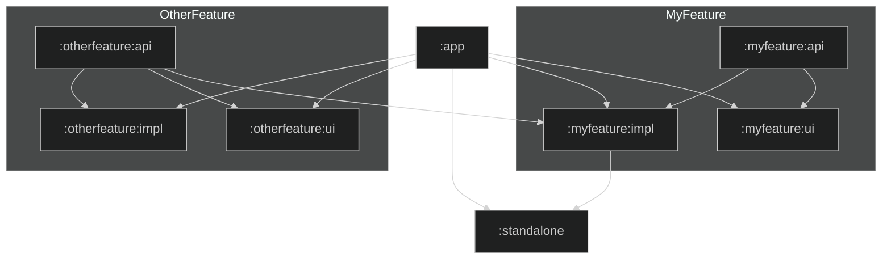
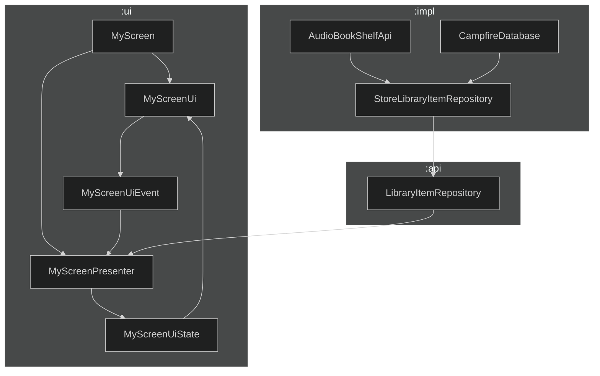

# Architecture

This document provides an overview of the architecture decisions used in this project. _TODO: Should describe more here really_

### Table of contents

1. [Modularization](MODULARIZATION.md)
2. [UI Layer](UI_LAYER.md)
3. [Data Layer](DATA_LAYER.md)
4. [DI Graph](DI_GRAPH.md)

---

## [Modularization](MODULARIZATION.md)
The module structure in this application can be distilled down into two module archetypes:
1. **Standalone** - A small dedicated module that serves a specific purpose, like `:core` or `:ui:appbar`
2. **Grouped** - An opinionated collection of modules for exposing a lightweight `:api` module that others can use and an `:impl` and `:ui` modules that provide implementations or related UI for the group.

## [UI Layer](UI_LAYER.md)
Campfire uses [Circuit] to drive its entire UI/Presentation stack. Check out their documentation for more in depth details on the framework. Follow the link about for a more in-depth breakdown of the UI anatomy in this application.

[Circuit]: https://slackhq.github.io/circuit/
