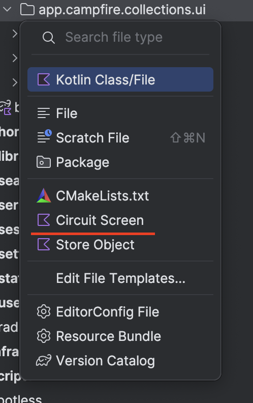

# UI Layer

This page outlines the screen and presentation architecture in this app. This includes location of `Screen` data keys,
the Composable function screens themselves, and the `Presenter` that drive the view state of these screen.

## [Circuit](https://slackhq.github.io/circuit/)

This application uses Slack's Circuit library to drive the screen, presenter, and navigation that make the entire
application work. Check out the link about to read more about this framework and how it works in detail.

# Anatomy
Each screen in the app follows this basic anatomy.

> [!TIP]
> You can use the `Circuit Screen` file template in the `New` context menu in the Project View to easily generate all the components to build a screen in this app.




## `{{NAME}}Screen`
The first bit is the screen "key" that you use to pass data to your screen and associate the composable UI and presenter to navigation.

```kotlin
@Parcelize
data class LibraryItemScreen(
  val libraryItemId: LibraryItemId,
) : Screen
```

> [!NOTE]
> Wait, isn't `@Parcelize` an Android concept? Yes, but the kotlin plugin lets you customize this with a custom annotation which you can then use expect/actual for multiplatform compatibility. Check out [ParcelizeConventionPlugin](../../gradle/build-logic/convention/src/main/kotlin/app/campfire/convention/ParcelizeConventionPlugin.kt) for more details!

## `{{NAME}}UiState`
Next, is the view state and view events which is a simple data class used to drive your `@Composable` UI and react to user input to update your data layer and subsequently the state.

```kotlin
@Immutable
data class LibraryItemUiState(
  val libraryItemState: LoadState<LibraryItem>,
  val eventSink: (LibraryItemEvent) -> Unit,
) : CircuitUiState

sealed interface LibraryItemEvent {
  data object Back : LibraryItemEvent
  data class LibraryItemClicked(val libraryItemId: LibraryItemId) : LibraryItemEvent
}
```

## `{{NAME}}Presenter`
The next bit is the presenter, the component responsible for coordinating the data layer and user input to drive the `UiState` of your screen.

Circuit uses a powerful composition based approach to generating and updating view states that brings the declarative nature and experience to writing presentation logic.

```kotlin
@CircuitInject(LibraryItemScreen::class, UserScope::class)
@Inject
class LibraryItemPresenter(
  @Assisted private val screen: LibraryItemScreen,
  @Assisted private val navigator: Navigator,
  private val repository: LibraryItemRepository,
  //…
) : Presenter<LibraryItemUiState> {

  @Composable
  override fun present(): LibraryItemUiState {
    val libraryItemState by remember {
      repository.observeLibraryItem(screen.libraryItemId)
        .map { LoadState.Loaded(it) as LoadState<LibraryItem> }
        .catch { emit(LoadState.Error as LoadState<LibraryItem>) }
    }.collectAsState(LoadState.Loading)

    return LibraryItemUiState(libraryItemState) { event ->
      when (event) {
        LibraryItemUiEvent.Back -> navigator.pop()
        //…
      }
    }
  }
}
```
## `{{NAME}}Ui`
The last bit in the UI architecture is the simpliest of all. Its just a single `@Composable` function that is fed your `UiState` generated by your presenter and is wired up with a custom annotation.

```kotlin
@CircuitInject(LibraryItemScreen::class, UserScope::class)
@Composable
fun LibraryItemUi(
  state: LibraryItemUiState,
  modifier: Modifier = Modifier,
) {
  // Compose the rest of the owl…
}
```
